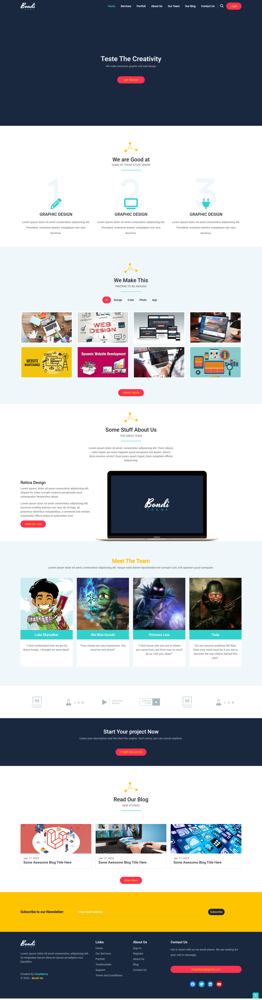

# Bondi theme

Bondi Landing Page is a modern and fully responsive landing page template ideal for businesses, agencies, and portfolios. This template is designed with HTML, CSS, Bootstrap, and JavaScript to ensure a smooth user experience and ease of customization.

## Features

- **Responsive Design**: Optimized for all screen sizes, ensuring a seamless experience on mobile, tablet, and desktop.
- **Filterable Portfolio**: A dynamic and filterable portfolio to showcase your work with different categories.
- **Smooth Scrolling**: Enhanced scrolling experience for smooth navigation between different sections of the page.

## Technologies Used

- **HTML**: For structuring the content of the page.
- **CSS**: To style and layout the design.
- **Bootstrap**: To style and layout the design.
- **Font Awesome**: For professional-grade icons.
- **JavaScript**: Adding interactivity to the template.

## Screenshots

